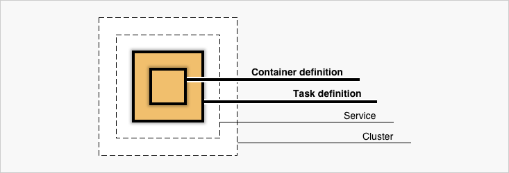
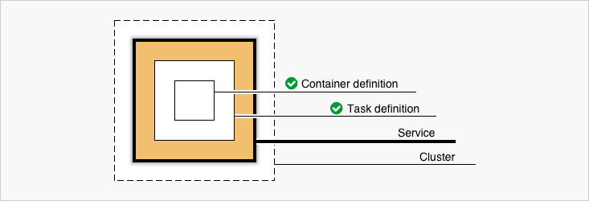
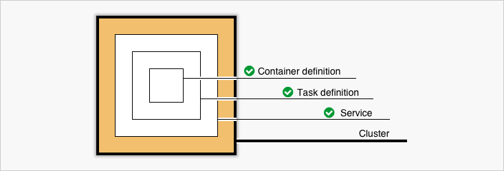

# Amazon ECS: Gerencie Docker na nuvem da AWS
##### https://cursos.alura.com.br/course/docker-na-amazon-ecs

## Pré-requisitos
* Docker
* AWS CLI

## Criando o primeiro cluster

Para dar um passo inicial e entender os conceitos utilizados pelo Elastic Container Service, basta seguir o Getting Started na página inicial do ECS após a leitura dos conceitos abaixo:

### Container
A especificação do container é formada por:
- Container name
- Docker image
- Memory and CPU limits do container
- Port Mappings
- Healthcheck se aplicável

E algumas outras configurações avançadas do container como: custom entrypoints, working directory, environment variables e network settings. 

### Task

A Task define as configurações da máquina virtual onde os containers serão entregues. Podendo ser instâncias EC2 ou também instância Fargate, com isso, deve-se ser também definido o memory e cpu usage que essa instância deverá conter.  

### Service

Um Service permite que você rode e mantenha um número específico (o "desired count") de instâncias simultâneas de uma task definida pelo cluster ECS.
Também é possível definir o Security Group e um Elastic Load Balancing.

### Cluster

A configuração do Cluster é onde as configurações  do cluster EC2 ou do cluster Fargate são definidos.

Ao utilizar um cluster EC2, você é capaz de definir a VPC, Subnets e Security Groups para este cluster ECS.

Quando se usa o Fargate, a infraestrutura é totalmente gerenciada pela AWS. Seus containers irão rodar sem a necessidade de você configurar e gerenciar cada instância (diferentemente do EC2).

A precificação quando se é utilizado um cluster Fargate é dada pela definição da Task citada anteriormente. Enquanto quando se utiliza um cluster EC2, a precificação é dada pelas instâncias EC2 utilizadas.

### Testando a criação

Após o entendimento destes conceitos, seguindo o Getting Started do ECS será possível verificar a execução do container em um cluster Fargate.
Para validar se tudo está em execução corretamente, basta acessar o cluster criado, em seguida acessar a task criada neste cluster e acessar o Public IP da mesma.

## Orquestração

A partir deste cluster criado, já é possível testar a Orquestração da Amazon ECS.

Para testar, pode-se deletar a Task criada anteriormente e verificar o que acontecerá.
Para isso, basta acessar o cluster criado, e após isso, selecionar a Task dentro do cluster e executar o Stop.
Feito isso, a Task será deletada, porém, após alguns segundos, a Task será criada automaticamente novamente.

Isso acontecerá porque o Service que está orquestrando essa Task possui a definição de uma Task ativa. Então caso a Task seja deletada, automaticamente o Service irá iniciar uma nova Task.

### Explorando a orquestração através do Amazon CLI

Toda a orquestração da Amazon ECS pode ser também realizada através do Amazon CLI. Para comprovar, será escalado a aplicação atual para duas tasks, basta seguir os próximos passos.

Para testar o Amazon CLI, primeiramente executar o comando para verificar o Cluster ECS criado:

`aws ecs list-clusters`

Isso irá mostrar o cluster criado anteriormente. Com isso, pode-se agora também verificar os Services associados a este cluster com o comando:

`aws ecs list-services --cluster <cluster_name>`

Como próximo passo então, pode-se também verificar a Task criada e associada a este Service:

`aws ecs list-tasks --service <service_name>`

Finalmente, para terstar a orquestração via CLI, usar o comando abaixo que irá atualizar o Service para ter duas instâncias da Task que ele gerencia:

`aws ecs update-service --service <service_name> --desired-count 2`

Para validar se tudo foi atualizado corretamente, acesse o Amazon Console e verifique que a quantidade de Taks do Service aumentou para duas, ou, utilize o comando abaixo:

`aws ecs describe-clusters --cluster <cluster_name>`

### Explorando o Amazon CLI com Query

Assim como outros comandos do Amazon CLI, é possível também utilizar `query` para filtrar apenas o conteúdo desejado do comando.

Para verificar o status do cluster e a quantidade de tasks que estão sendo executadas, usando o comando `describe-clusters`, adicionar a query da seguinte forma:

`aws ecs describe-clusters --cluster <cluster_name> --query 'clusters[*].[clusterName,status,runningTasksCount]'`   

E desta mesma forma, é possível também adicionar alias para os itens encontrados pela query, como no exemplo abaixo:

`aws ecs describe-clusters --cluster <cluster_name> --query 'clusters[*].{nome:clusterName,estado:status,emExecucao:runningTasksCount}'`

## Criando o ECS cluster com EC2

Para testar toda a infraestrutura completa sob seu controle, pode ser criado o ECS cluster com instâncias EC2 ao invés de instâncias Fargate, e para isso, será descritos os passos abaixo.

No AWS Console, entrar no menu do ECS e então clicar no botão de criação de um novo cluster.

Selecionar a opção de EC2 Linux + Networking que é o objetivo desta seção.

Escolher o nome do cluster conforme desejado no campo Cluster name;

#### Instance configuration
- Para o teste, utilizar On-Demand Instance para evitar falhas não desejadas;
- Escolher o EC2 instance type (para fins de teste, t2.micro que faz parte do plano gratuito atende muito bem);
- Número de instâncias no cluster;
- A imagem a ser utilizada (de preferência a mais atual);
- O espaço em disco (atualmente o mínimo é de 30GiB);
- Selecionar o Key pair a ser usado caso seja necessário executar SSH nas instâncias que serão criadas;

#### Networking

Aqui será possível criar uma nova VPC para este cluster, porém, para testes, pode ser utilizada a VPC criada automaticamente ao ter sido criado o ECS cluster com o Fargate através do Getting Started.

- Selecionar a VPC criada anteriormente (normalmente com o nome ECS default);
- Selecionar as duas Subnets;
- Selecionar o Security Group criado anteriormente automaticamente (normalmente o nome será *-default-EcsSecurityGroup).

Agora basta selecionar Create para criar toda o ECS cluster com as instâncias EC2.

### Analisando o resultado

Para analisar se toda a infraestrutura foi criada corretamente, acesse o menu EC2. Em seguida, acessar:

- Volumes para verificar se os volumes foram criados corretamente (dois volumes para cada instância: um para o SO e outro disponível para a instância utilizar);
- Running instances para verificar se a quantidade de instâncias foi criada corretamente.

Em seguida, já é possível também testar se o cluster está escalonando corretamente. Para fazer esse teste, acesse as Running Instances e termine uma das instâncias, automaticamente, após alguns segundos, uma nova instâncias iniciará para atender o cluster corretamente. Isso tudo está ocorrendo pois durante a criação do cluster, a Amazon automaticamente criou um Auto Scaling Group que irá gerenciar este cluster.

Para verificar o Auto Scaling Group, acesse o menu EC2 e em seguinda no menu lateral acessar o Auto Scaling Groups. Então será possível ver a definição da quantidade de instância desejada, em execução, e também aqui é possível escalar o cluster com mais instâncias conforme necessário.

## Escalando o cluster com CLI

Para escalar o cluster conforme desejado, é possível alterar através do Amazon Console conforme o passo anterior, ou através do CLI.

Para escalar com o CLI, primeiramente liste o auto-scaling-group com o comando:

`aws autoscaling describe-auto-scaling-groups`

Em seguida, basta utilizar a opção `set-desired-capacity` com a quantidade de instâncias desejadas, conforme o comando abaixo:

`aws autoscaling set-desired-capacity --auto-scaling-group-name <name> --desired-capacity 2` 

Pronto, basta acessar o AWS Console e verificar se a quantidade de instâncias está sendo atendida através das Running Instances do EC2.