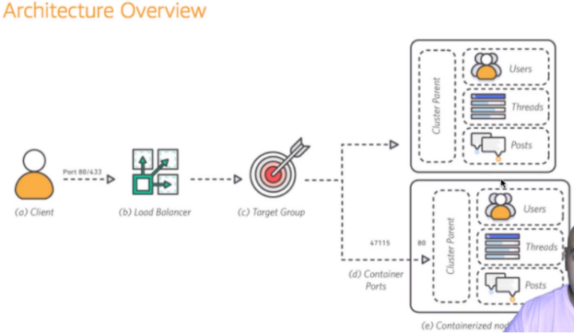
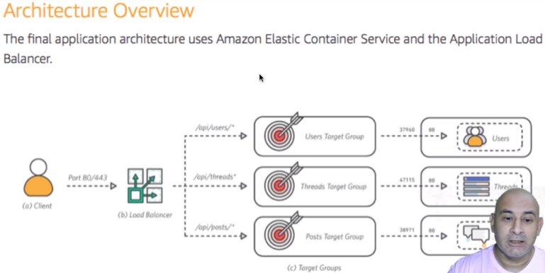

# Amazon ECS: Gerencie Docker na nuvem da AWS
##### https://cursos.alura.com.br/course/docker-na-amazon-ecs

## Pré-requisitos
* Docker
* AWS CLI

## Criando o primeiro cluster

Para dar um passo inicial e entender os conceitos utilizados pelo Elastic Container Service, basta seguir o Getting Started na página inicial do ECS após a leitura dos conceitos abaixo:

### Container
A especificação do container é formada por:
- Container name
- Docker image
- Memory and CPU limits do container
- Port Mappings
- Healthcheck se aplicável

E algumas outras configurações avançadas do container como: custom entrypoints, working directory, environment variables e network settings. 

### Task

A Task define as configurações da máquina virtual onde os containers serão entregues. Podendo ser instâncias EC2 ou também instância Fargate, com isso, deve-se ser também definido o memory e cpu usage que essa instância deverá conter.  

### Service

Um Service permite que você rode e mantenha um número específico (o "desired count") de instâncias simultâneas de uma task definida pelo cluster ECS.
Também é possível definir o Security Group e um Elastic Load Balancing.

### Cluster

A configuração do Cluster é onde as configurações  do cluster EC2 ou do cluster Fargate são definidos.

Ao utilizar um cluster EC2, você é capaz de definir a VPC, Subnets e Security Groups para este cluster ECS.

Quando se usa o Fargate, a infraestrutura é totalmente gerenciada pela AWS. Seus containers irão rodar sem a necessidade de você configurar e gerenciar cada instância (diferentemente do EC2).

A precificação quando se é utilizado um cluster Fargate é dada pela definição da Task citada anteriormente. Enquanto quando se utiliza um cluster EC2, a precificação é dada pelas instâncias EC2 utilizadas.

### Testando a criação

Após o entendimento destes conceitos, seguindo o Getting Started do ECS será possível verificar a execução do container em um cluster Fargate.
Para validar se tudo está em execução corretamente, basta acessar o cluster criado, em seguida acessar a task criada neste cluster e acessar o Public IP da mesma.

## Orquestração

A partir deste cluster criado, já é possível testar a Orquestração da Amazon ECS.

Para testar, pode-se deletar a Task criada anteriormente e verificar o que acontecerá.
Para isso, basta acessar o cluster criado, e após isso, selecionar a Task dentro do cluster e executar o Stop.
Feito isso, a Task será deletada, porém, após alguns segundos, a Task será criada automaticamente novamente.

Isso acontecerá porque o Service que está orquestrando essa Task possui a definição de uma Task ativa. Então caso a Task seja deletada, automaticamente o Service irá iniciar uma nova Task.

### Explorando a orquestração através do Amazon CLI

Toda a orquestração da Amazon ECS pode ser também realizada através do Amazon CLI. Para comprovar, será escalado a aplicação atual para duas tasks, basta seguir os próximos passos.

Para testar o Amazon CLI, primeiramente executar o comando para verificar o Cluster ECS criado:

`aws ecs list-clusters`

Isso irá mostrar o cluster criado anteriormente. Com isso, pode-se agora também verificar os Services associados a este cluster com o comando:

`aws ecs list-services --cluster <cluster_name>`

Como próximo passo então, pode-se também verificar a Task criada e associada a este Service:

`aws ecs list-tasks --service <service_name>`

Finalmente, para terstar a orquestração via CLI, usar o comando abaixo que irá atualizar o Service para ter duas instâncias da Task que ele gerencia:

`aws ecs update-service --service <service_name> --desired-count 2`

Para validar se tudo foi atualizado corretamente, acesse o Amazon Console e verifique que a quantidade de Taks do Service aumentou para duas, ou, utilize o comando abaixo:

`aws ecs describe-clusters --cluster <cluster_name>`

### Explorando o Amazon CLI com Query

Assim como outros comandos do Amazon CLI, é possível também utilizar `query` para filtrar apenas o conteúdo desejado do comando.

Para verificar o status do cluster e a quantidade de tasks que estão sendo executadas, usando o comando `describe-clusters`, adicionar a query da seguinte forma:

`aws ecs describe-clusters --cluster <cluster_name> --query 'clusters[*].[clusterName,status,runningTasksCount]'`   

E desta mesma forma, é possível também adicionar alias para os itens encontrados pela query, como no exemplo abaixo:

`aws ecs describe-clusters --cluster <cluster_name> --query 'clusters[*].{nome:clusterName,estado:status,emExecucao:runningTasksCount}'`

## Criando o ECS cluster com EC2

Para testar toda a infraestrutura completa sob seu controle, pode ser criado o ECS cluster com instâncias EC2 ao invés de instâncias Fargate, e para isso, será descritos os passos abaixo.

No AWS Console, entrar no menu do ECS e então clicar no botão de criação de um novo cluster.

Selecionar a opção de EC2 Linux + Networking que é o objetivo desta seção.

Escolher o nome do cluster conforme desejado no campo Cluster name;

#### Instance configuration

- Para o teste, utilizar On-Demand Instance para evitar falhas não desejadas;
- Escolher o EC2 instance type (para fins de teste, **t2.micro** que faz parte do plano gratuito atende muito bem);
- Número de instâncias no cluster;
- A imagem a ser utilizada (de preferência a mais atual);
- O espaço em disco (atualmente o mínimo é de 30GiB);
- Selecionar o Key pair a ser usado caso seja necessário executar SSH nas instâncias que serão criadas.

#### Networking

- Selecione a criação de uma nova VPC.

Agora basta selecionar Create para criar toda o ECS cluster com as instâncias EC2.

### Analisando o resultado

Para analisar se toda a infraestrutura foi criada corretamente, acesse o menu EC2. Em seguida, acessar:

- Volumes para verificar se os volumes foram criados corretamente;
- Running instances para verificar se a quantidade de instâncias foi criada corretamente.

Em seguida, já é possível também testar se o cluster está escalonando corretamente. Para fazer esse teste, acesse as Running Instances e termine uma das instâncias. Automaticamente, após alguns segundos, uma nova instância iniciará para atender o cluster corretamente. Isso tudo está ocorrendo pois durante a criação do cluster, a Amazon automaticamente criou um Auto Scaling Group que irá gerenciar este cluster.

Para verificar o Auto Scaling Group, acesse o menu EC2 e em seguinda no menu lateral acessar o Auto Scaling Groups. Então será possível ver a definição da quantidade de instância desejada, em execução, e também aqui é possível escalar o cluster com mais instâncias conforme necessário.

## Escalando o cluster

Para escalar o cluster conforme desejado, é possível alterar através do Amazon Console conforme o passo anterior, ou através do CLI.

Para escalar com o CLI, primeiramente liste o auto-scaling-group com o comando:

`aws autoscaling describe-auto-scaling-groups`

Em seguida, basta utilizar a opção `set-desired-capacity` com a quantidade de instâncias desejadas, conforme o comando abaixo:

`aws autoscaling set-desired-capacity --auto-scaling-group-name <name> --desired-capacity 2` 

Pronto, basta acessar o AWS Console e verificar se a quantidade de instâncias está sendo atendida através das Running Instances do EC2.

## Amazon ECR - Elastic Container Registry

Amazon Elastic Container Registry (ECR) é um registry de containers que possibilita ao desenvolvedor ter um simples armazenamento, gerenciamento e entrega de imagens de container.

---

#### Precificação

O armazenamento custa 0,10 USD por GB/mês

Como parte do nível gratuito da AWS, você pode começar a usar o Amazon Elastic Container Registry gratuitamente. O Amazon ECR oferece aos novos clientes 500 MB por mês de armazenamento durante um ano.

---

A partir deste momento, utilizaremos o Amazon ECR para armazenar a imagem que será utilizada durante os testes.

A imagem utilizada será: https://hub.docker.com/r/rmerces/api-monolitica/

A imagem contém uma simples aplicação REST que tem os serviços de `/api/users`, `/api/threads` e `/api/posts`. Para mais informações, acessar o dockerhub acima.

#### Criando o registry

Para criar o registry, acessar o Amazon ECR e clicar no botão de criação de um novo registry. No momento da criação é necessário somente preencher o nome do repositório.
Neste caso, utilizar o mesmo nome da aplicação que será utilizada no teste `api-monolitica`.

Em seguida, na tela dos repositórios do ECR, no canto superior direito é possível ver um botão `View push commands` que ensinará como se fazer o push da imagem desejada no repositório criado. Vamos utilizar alguns destes passos a seguir.

Primeiramente, utilizar o comando de login no Amazon ECR através do comando fornecido no tutorial da Amazon.

`aws ecr get-login-password --region sa-east-1 | docker login --username AWS --password-stdin <seu_id>.dkr.ecr.<zona>.amazonaws.com`

Depois disso, baixar a imagem do dockerhub que está sendo utilizada nesse exemplo.

`docker pull rmerces/api-monolitica`

Gerar a tag da imagem conforme documentação da Amazon, porém, não se esqueça de adicionar o nome da imagem local correamente.

`docker tag rmerces/api-monolitica:latest <seu_id>.dkr.ecr.<zona>.amazonaws.com/api-monolitica:latest`

E após já possuir a tag gerada, realizar o push conforme a documentação.

`docker push <seu_id>.dkr.ecr.<zona>.amazonaws.com/api-monolitica:latest`

Com estes passos realizados, a imagem já estará publicada na AWS, basta acessar o repositório para visualizar a imagem.

#### Repository lifecycle policy

Para manter um bom gerenciamento de todas as imagens geradas e dando atenção ao custo envolvido, a Amazon providencia um mecanismo de gerenciamento automático das imagens.

Acessando o item de Lifecycle policy no menu lateral, é possível criar regras para que algumas imagens sejam excluídas conforme a regra que o usuário criar.

Clicando no botão `Create rule`, após preencher os dados de identificação da regra, por exemplo, é possível criar uma regra que mantenha somente as duas últimas imagens de development, preenchendo:

* Tag prefixes: dev
* Match criteria: Image count more than : 2

Com isso, imagens que tenham o prefixo `dev` e tenha mais que duas imagens, quando a regra for executada, as imagens mais antigas serão excluídas automaticamente. Simples e muito prático.

## Criando as tasks no cluster ECS com EC2

Vamos neste momento entregar a aplicação monolítica acima, ficando com a arquitetura desta forma:

Nesta etapa, assim como foi feito durante a criação do cluster ECS com Fargate, criaremos a definição da Task. 

Para isso, acessar o menu ECS e acessar Task Definitions. Clicar em Create new task definition e em seguida selecionar a infraestrutura com EC2.

Escolher o nome da task, pode-se aqui também reutilizar a Role criada anteriormente, e em Network Mode podemos utilizar Bridge.

Adicionar agora um container para esta task, dando um nome a ele, e na Image, copiar a URI da imagem criada anteriormente no Amazon ECR. Com a imagem que que definimos, pode-se usar um Soft Limit de memória de 256. No Port Mappings, deixar o Host Port vazio para que seja possível habilitar o Load Balancer, e em Container Port definir 3000 que é a porta utilizada pela aplicação.

Com essas informações preenchidas já será possível criar a Task, então selecione a opção para criar.

Essa task pode ser rodada sem a necessidade da criação de um Service. Vamos rodar a Task para testá-la por hora.

#### Rodando a Task

Acessando o item de Task Definitions dentro do menu de ECS, selecione o checkbox da task criada anteriormente, e nas actions selecione Run Task.

Selecione o Launch Type como EC2 (Fargate já foi testado Getting Started), selecione o Cluster já criado anteriormente e já pode clicar na opção Run Task.

Após a Task iniciar, para verificar se ela está executando com sucesso, clique para ver os detalhes desta Task criada, e na seção de Containers, expanda o item do container criado e acesse o External Link. Este link num primeiro momento não vestará acessível pois a regra do Security Group criado permite apenas acesso à porta 80.

Acesse o item Security Groups dentro do menu EC2, e no Security Group criado para esta nossa VPC (terá descrição EC2ContainerService-<nome_do_cluster_ecs_criado>-...), adicione uma Inboud Rule para All TCPs vindo do IP de sua máquina apenas para realizar os testes. Após isso, a task já estará acessível e poderá ser testada.

#### Gerenciando a Task via CLI

Para visualizar a Task criada via CLI, utilizar o comando:

`aws ecs list-tasks --cluster <nome_do_cluster>`

Para parar a task, utilizar o comando:

`aws ecs stop-task --task <id_da_task> --cluster <nome_do_cluster>`

Ao executar o comando de `stop-task`, verificar se a task realmente foi parada com o comando de `list-tasks`.

Para visualizar as Tasks Definitions criadas anteriormente, execute o comando abaixo:

`aws ecs list-task-definitions`

Repare que as Tasks Definitions não estão associadas a nenhum cluster, elas são independentes, e por isso o comando não necessita do nome do cluster.

Para rodar novamente a Task anterior dentro do cluster criado:

`aws ecs run-task --cluster <nome_do_cluster> --task-definition <nome_task_definition>`

Para validar se a Task está executando, executar novamente o comando de `list-tasks`.

E para se executar várias tasks ao mesmo tempo, basta adicionar o parâmetro `count` no comando de `run-task`. Adicione mais 3 tasks conforme abaixo:

`aws ecs run-task --cluster <nome_do_cluster> --task-definition <nome_task_definition> --count 3`

## Criando um Service

Para ter o gerenciamento correto das tasks, assim como aprendemos anteriormente, é utilizado o Service. Então neste passo vamos criar um Service fazer o gerenciamento das Tasks.

Para criar o Service, acesse o cluster criado. Em seguida na aba Service, clicar no botão de criação de Service.

#### Configure service

* Launch Type: Utilizar EC2 para utilizarmos as instâncias EC2 deste cluster;
* Task Definition: Selecionar a Task Definition criada anteriormente;
* Cluster: utilizar o cluster criado com as instâncias EC2;
* Service name: o nome desejado do Service;
* Service type: selecionar Replica;
* Number of tasks: utilizaremos 2;
* Minimun/Maximun Percent: deixar o padrão (porcentagem de disponibilidade durante delivery);
* Deployment Type: selecionar o desejado;
* Placement Templates: pode ser usado custom (estratégia usada para decidir em qual instância EC2 cada novo container irá subir ou cair).

#### Configure network

* Health check grace period: tempo em que o loadbalancer deve esperar para realizar o healthcheck após a task iniciar;

##### Load balancing

Aqui será necessário criar um Load Balancer para atender a aplicação:

* Load balancer type: Selecionar Application Load Balancer;
* Service IAM role: utilizar a IAM já criada;
* Load balancer name: neste campo será necessário a criação de um novo Load Balancer, basta selecionar o link fornecido abaixo. Criaremos numa nova aba este Load Balancer e retornaremos, siga os passos abaixo:

---

#### Create Load Balancer

* Load balancer type: Application Load Balancer - HTTP/HTTPS é o que desejamos para a nossa aplicação;
* Name: utilizar o nome desejado (ex: lb-api-monolitica);
* Scheme: internet-facing pois é um lb exposto à internet;
* IP address type: ipv4 atende;
* Listeners: um listener http atenderá a aplicação de exemplo;
* Availability Zones: selecionar a VPC e suas subnets para que seja balanceado para todas as subnets;
* Assign a security group: selecione o SG criado para nosso cluster ECS;
* Target group: Criar um novo grupo, para esta aplicação pode deixar tudo com valores default, mas é neste passo que poderia ser inserido o path do health-check da aplicação;

Em seguida pular as próximas etapas e finalizar a criação do Load Balancer. Após isso, retornar para a criação do Service para nossa aplicação.

---

* Load balancer name: utilizando o botão refresh já será possível selecionar o load balancer criado, selecione-o;
* Container to load balance: Adicione o nosso container a esta lista;
* Production listener port: selecione o listener que foi criado no load balancer 80:HTTP;
* Target group name: selecione o group criado no load balancer;

Agora basta seguir até o fim e finalizar a criação do Service.

Com o Service criado, irá ser criado com ele 2 Tasks automaticamente, estas são as Tasks que foram definidas para que o Service gerenciasse, portanto, iniciarão assim que o Service for criado.

Para acessar agora as Tasks que são gerenciadas por este Service, acessaremos o Load Balancer que foi criado, porém, neste momento, o Load Balancer não tem um Security Group associado a ele que o permita enviar a requisição que recebeu para os containers que associamos a ele.

### Ajustando o Security Group

Então neste momento vamos adicionar as regras ao Security Group para que ele consiga enviar essas requests aos containers.

Acesse o menu de Security Groups no EC2, selecione o SG criado para o cluster ECS. Adicionaremos duas Inboud Rules a ele, que serão para as duas Subnets que foram criadas na VPC utilizada pelo cluster ECS.

Então neste momento, acesse no menu do VPC as Subnets que foram criadas para a VPC do cluster ECS, e copie o IPv4 CIDR das duas.

Volte às Inbound Rules do Security Group, e adicione duas Inbound Rules recebendo All TCP e cada uma para o IP de cada uma das duas subnets (algo como: 10.0.0.0/24 e 10.0.1.0/24).

Pronto, neste momento a aplicação já será acessível, basta acessar o DNS fornecido pelo Load Balancer! 

## Entregando no ECS uma arquitetura de microsserviços

Agora que temos toda a arquitetura entregue e rodando com uma aplicação monolítica, que tal simularmos um ambiente com várias aplicações, como numa arquitetura de microsserviços? Faremos isso agora.

De forma resumida, cada um dos três paths da aplicação anterior `/api/users`, `/api/threads` e `/api/posts` será uma aplicação diferente. Ficando a arquitetura a partir deste momento desta forma:

### Adicionando as imagens ao ECR

Primeiramente vamos adicionar estas imagens ao ECR. Faça o pull das imagens:

`docker pull rmerces/api-users`

`docker pull rmerces/api-threads`

`docker pull rmerces/api-posts`

Em seguida, crie três repositórios no ECR, um para cada uma das imagens, e para cada repositório criado, execute o push de sua respectiva imagem com os comandos que o ECR exibe ao acessar o repositório da imagem, não se esquecendo de que não é necessário realizar o build da imagem e também de adicionar o `rmerces` no momento de gerar a `tag` (`login`, `tag` e `push`).
Exemplo:

`docker tag rmerces/api-users:latest <id_repositorio>.dkr.ecr.<zona>.amazonaws.com/api-users:latest`

`docker push <id_repositorio>.dkr.ecr.<zona>.amazonaws.com/api-users:latest`

### Criando as Tasks Definitions

Vamos criar as Tasks Definitions para que seja possível subir estas imagens ao cluster ECS utilizando os Services para gerenciá-las.

Acesse o menu ECS e entre na seção de Task Definitions. Clique para criar uma nova Task Definition e selecione o Launch Type como EC2.

Preencha o formulário como a seguir:

* Task Definition Name: pode utilizar o mesmo nome da imagem;
* Task Role: a mesma Role utilizada anteriormente criada junto com o cluster ECS;
* Network M<ode: Bridge;
* Add container: adicione um container. Adicione o mesmo nome da imagem para facilitar e no campo Image, copie a URI do repositório ECR da imagem criada anteriormente. Selecione Soft Limit de 256 e nos Port Mappings deixe o Host Port em branco (porta dinâmica) e coloque o Container Port como 3000.

Depois disso já é possível realizar a criação, porém, antes disso, no fim do formulário há o botão *Configure via JSON*. Este JSON já contém toda a nossa Task Definition no formato JSON. Copie esse JSON para facilitar a criação das próximas tasks, onde será necessário apenas dar replace nos nomes de `api-users` para `api-threads` ou `api-posts`. 

Então, crie as duas próximas Tasks Definitions através do JSON copiado anteriormente e substituindo os nomes.

### Testando as Tasks Definitions

Com todas as Tasks Definitions criadas, vamos testá-las para ver se está tudo ok.

Acesse o cluster ECS criado. Selecione a aba Tasks e clique em Run new Task.

* Launch Type: EC2
* Task Definition: a task que irá testar

Finalize a criação.

Observe que na aba de Tasks dentro do cluster ECS, a coluna Started By, diferentemente de quando a Task é gerenciada por um Service, ela estará vazia.

Clique na Task, e dentro dela, expanda o container criado e tente acessar o External Link gerado. Caso não consiga acessar, verifique se o Security Group do cluster ECS possui uma Inbound Rule liberada para All TCPs vindo de seu IP, se não houver, crie e já será possível acessar o container.

Faça estes passos para todas as Tasks Definitions criadas para testá-las.

Depois de testá-las, pode deletar cada uma destas Tasks.

### Ajustando o Load Balancer

Para atender a aplicação como desejado, ou seja, direcionar `/api/users`, `/api/threads` e `/api/posts` cada um para uma task, configuraremos o Load Balancer para isso.

Então, acessando o menu EC2, entre no item de Load Balancer e clique para criar um novo.

* Selecione a opção de HTTP/HTTPS;
* Dê o nome desejado (lb-api-microservicos);
* Selecione a VPC criada para o cluster ECS;
* Selecione as subnets da VPC;
* Siga com os próximos passos até o passo de Configure Security Groups, nele, selecione o Security Group que foi criado para o cluster ECS;
* No próximo passo, crie um New target group para a aplicação api-users. Basta preenche com este nome e seguir para o próximo passo;
* Finalize a criação.

Com o Load Balancer criado, no menu lateral logo abaixo do Load Balancers, acesse o item Target Groups. Aqui iremos criar os dois Target Groups para api-threads e api-posts. Crie os dois com estes mesmos nomes e apenas selecione a VPC do Cluster ECS, as demais configurações permanecem no padrão.

Depois de ter criado os Target Groups, vá até o Load Balancer criado, acesse a aba Listeners, e no Listener HTTP:80 clique em View/Edit Rules.

Adicione agora três regras, cada uma para atender sua respectiva Tasks conforme abaixo:

* Path: `/api/users`, `/api/threads` e `/api/posts`;
* Forward to: `api-users`, `api-threads` e `api-posts`.

### Criado o Service para as Tasks do microsserviço

Agora apenas falta criar o Service para que ele gerencie as Tasks.

Acesse o menu ECS e selecione o cluster criado. Na aba de Services vamos criar os **três** Services para cada uma das Tasks.

* Launch Type: EC2;
* Task definition: a Task Definition para sua devida Task;
* Service name: pode ser o mesmo que o nome da Task;
* Number of tasks: 2 é o suficiente;
* Load Balancing Type: na próxima etapa, selecione Application Load Balancer;
* ServiceIAMRole: a role já criada para o ECS;
* Load Balancer Name: selecione aqui o Load Balancer que criamos no passo anterior;
* Container : port: adicione aqui o container ao Load Balancer;
* Production listener port: Selecione HTTP:80;
* Target group name: selecione o Target Group corresponde.

Pode finalizar a criação, e agora a Service será criada e irá subir e gerenciar as Tasks com os containers que configuramos. Não se esqueça, repita essa criação para cada uma das três Tasks.

Após a criação dos três Services, não será possível que o todas as Tasks executem, pois ocorrerá falta de memória. Para evidenciar isso, acesse o Service que não tem as Tasks atendidas e vá na aba Events. Nesta aba terá a descrição  do evento de falta de memória ocorrendo.

Para liberar memória, vamos deletar a api-monolitica. Acesse o Service da api-monolitica nesse momento e altere o Number of Tasks para zero. Isso irá liberar memória para que as Tasks faltantes venham subir. *PS: Verifique se as Tasks da api-monolitica irão cair, senão cair automaticamente, acesse elas e dê o Stop.*

### Testando toda a arquitetura

Com as Tasks, Tasks Definitions, Services e Load Balancer criados e configurados, agora vamos testar essa arquitetura.

Acesse o Load Balancer criado para esta arquitetura e copie o DNS gerado. Acesse o DNS do Load Balancer e então, valide cada um dos três cenários:

* `/api/users`
* `/api/threads`
* `/api/posts`
 
O Load Balancer deverá receber a request e baseado no path, deverá redirecionar para sua respectiva Task que rodará o container que conseguirá responder essa request, caso haja redirect para um das Tasks indevidas, ocorrerá um `404 NOT FOUND`.

Se os três paths responderem corretamente, pronto! Toda a arquitetura está funcionando perfeitamente.

## Conclusão

Aprendemos então primeiramente a definição dos conceitos de Container Definition, Task Definition, Service e Cluster.

Depois disso fizemos o deploy de uma aplicação monolítica dentro de um cluster ECS.

Aprendemos nesta etapa também, a criação e gerenciamento de imagens Docker através do ECR.

E como último passo, criamos a arquitetura para atender a antiga aplicação monolítica que agora foi separada em três diferentes aplicações, utilizando três imagens diferentes e o Load Balancer fazendo o devido redirecionamento.

## Limpando o ambiente

Agora como último e muito importante passo, vamos limpar tudo o que criamos.

1. No menu EC2 acesse o item de Load Balancers e delete-os;
2. Acesse os clusters criados, e dentro deles, clique para deletar;
3. Finalmente, acesse o menu ECR e delete os repositórios.

Pronto, tudo finalizado com sucesso!